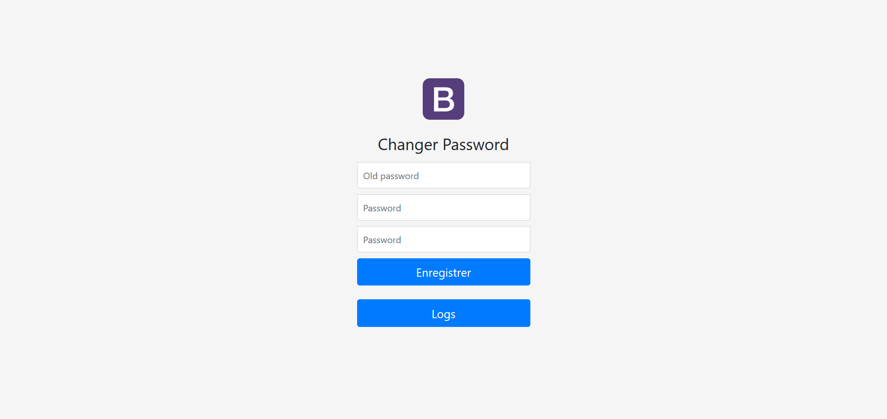

# Projet Web Of Things [M2IA]

Ceci est le repository du projet de Smart Environments de la formation M2 Intelligence Artificielle de l'Université Claude Bernard Lyon 1.

L'objectif était d'utiliser un arduino, au moins un capteur, au moins un actionneur, une interface web et de l'intelligence ajoutée pour en faire un projet.

Notre projet est un système de verrou pouvant être débloqué par la prononciation du mot de passe correct.
Il est possible de modifier le mot de passe en utilisant l'interface web.

## Membres du groupe : 
* Nicolas Désilets 11923363
* Thomas Ranvier 11915001
* Valentin Comas 11500223
* Arnaud Bressot 11505990

Nous avons réaliser l'ensemble du projet sur la machine d'Arnaud sans réellement se partager les tâches, chaque personne a apporté ses idées et ses recherches pour les différentes technologies utilisées.

## Conception du projet et technologies utilisées

### Matériel utilisé
* Un arduino
* Un PC portable
* Une planche à contact
* Des cables
* 4 leds (bleue, rouge, vert, orange)
* Un servo-moteur
* Un bouton

### Page Web

Nous avons créer une page index.html qui utilise XMLHttpRequest (en javascript) pour communiquer avec le serveur python.

### Installation et configuration du serveur python

Il s'agit de Python 3.7.5. Il faudra utiliser la commande suivante pour installer les librairies necessaires.

```
pip install _thread speech_recognition flask flask_restful json flask_jsonpify flask_cors datetime signal sounddevice scipy pydub serial glob re
```

Pour lancer le serveur Python :

```
python /chemin_vers_projet/nlp_arduino/NLP/server.py
``` 


### Intelligence ajoutée

L'intelligence ajoutée à ce projet est une reconnaissance vocale étant capable de traduire un contenu oral en un texte écrit.

Nous avons utilisé la fonction 'recognize_google' de la librairie open-source [speech_recognition](https://github.com/Uberi/speech_recognition).
Cette fonction envoie une requête web à l'API Google Speech Recognition contenant l'audio et l'API renvoie une réponse contenant le texte écrit reconnu.

### Fonctionnement et communication de l'ensemble

Un bouton sur l'arduino permet de lancer la procédure d'écoute.

Lorsque le bouton est pressé la led bleue s'allume et un signal est envoyé par l'arduino au serveur python.

Lorsque le serveur python reçoit le signal il lance l'écoute sur le microphone de l'ordinateur pour une durée arbitraire de 5 secondes.
L'utilisateur peut alors prononcer le mot de passe.

Une fois les 5 secondes écoulées, l'audio enregistré est passé à l'API Google Speech Recognition qui est capable de traduire le contenu oral en un texte écrit.
On teste ensuite si le mot de passe défini est contenu dans le texte, il y a ensuite deux cas de figure :
* Si le mot de passe est reconnu, le serveur python envoi un signal positif à l'arduino.
  En recevant le signal l'arduino ouvre le loquet un court instant avant de le refermer automatiquement, la led bleu s'éteint et la led verte s'allume un court instant.
* Si le mot de passe n'est pas reconnu, le serveur python envoie un signal négatif à l'arduino.
  Le loquet reste fermé, la led bleu s'éteint et la led rouge d'allume un court instant.

La led bleu permet de symboliser le moment d'écoute, les leds rouges et vertes permettent d'indiquer si le mot de passe est valide ou non.

L'utilisateur peut utiliser l'interface web pour modifier le mot de passe.
Lorsque le mot de passe est modifié, la led orange clignote.
Ce clignotement permet d'indiquer à l'utilisateur que le mot de passe a été modifié, cela peut être utile si le système est partagé par plusieurs personnes par exemple.
Le clignotement de la led orange s'arrête la prochaine fois que l'utilisateur utilise le système, ce qui permet de s'assurer qu'il aura été informé de la modification.

## Aperçu du projet fini

Photo de l'installation électronique et capture d'écran de l'interface web

 

## Conclusion et possibles améliorations

Ce projet est une version très simplifiée d'un verrou fonctionnant à la voix.
Il est évident que d'un point de vue sécurité le fait de prononcer son mot de passe à l'oral n'a pas vraiment de sens.
Dans la pratique on pourrait plutôt imaginer un système qui se base sur la reconnaissance de la voix et non pas d'un mot de passe.
